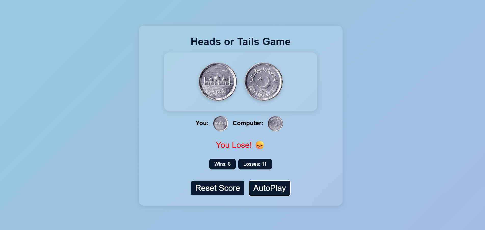

# 🎲 Responsive Head and Tail Game

A fully responsive, modern, and interactive Heads or Tails game built using HTML, CSS, and JavaScript.

## 🚀 Live Demo

👉 [Play it on Netlify](https://head-tail-bysidra.netlify.app/)

## 🖼️ Screenshot

## ✨ Features

- 🔁 Play head or tail with computer
- 🧠 Tracks your wins and losses with localStorage
- 🔄 AutoPlay mode with random choices
- 🔄 Reset score anytime
- 📱 Fully responsive layout for mobile and desktop
- 🎨 Professional UI with smooth hover animations

## 🛠️ Built With

- HTML5
- CSS3 (Flexbox + Responsive Design)
- JavaScript (DOM, localStorage)

## 📁 File Structure

📦 responsive-head-tail-game
┣ 📄 index.html
┣ 📄 style.css (if separated)
┣ 📄 Heads.jpeg
┣ 📄 Tails.jpeg
┣ 📄 README.md
┣ 📄 LICENSE
┣ 📄 .gitignore

## 🧾 License

This project is licensed under the MIT License – see the [LICENSE](./LICENSE) file for details.

---

## 🙋‍♀️ Author

Made with ❤️ by [Sidra](https://github.com/codeswithsidra)

